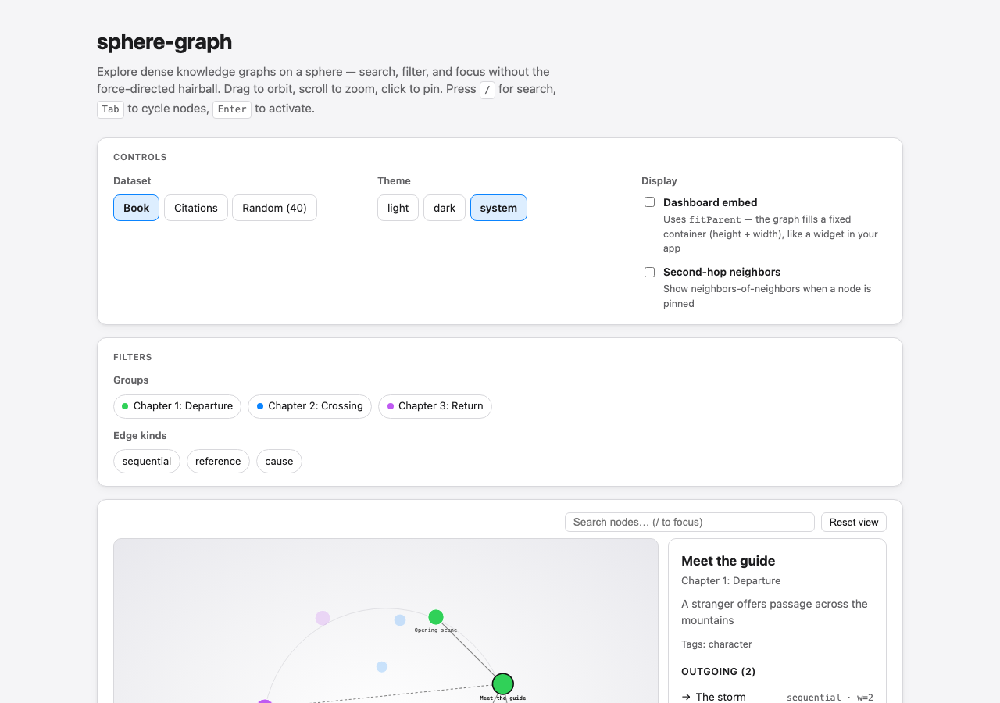

# sphere-graph

A framework-agnostic sphere layout, plus a React SVG component, for
rendering dense node-link graphs without the "hairball" a force-directed
layout produces.



## Why

Force-directed layouts (d3-force and friends) work well for sparse graphs.
Once a graph gets dense enough — every node linking to several others — the
physics collapses everything into an unreadable clump in the middle, no
matter how much you tune charge/collision.

`sphere-graph` sidesteps the physics: it places every node on a sphere with
guaranteed angular spacing (a Fibonacci lattice, optionally split into one
longitude wedge per group), then renders it with a simple orbit camera. You
get visible gaps between nodes at any graph size, with no simulation to
tune, and edges are only drawn for the focused node — drawing all of them at
once is unreadable even with perfect spacing.

## Install

```bash
npm install sphere-graph
```

## Usage

```tsx
import { SphereGraph } from "sphere-graph";
import "sphere-graph/style.css";

const nodes = [
  { id: "a", label: "Opening", group: "ch1", description: "First scene", tags: ["narrative"] },
  { id: "b", label: "Conflict", group: "ch1" },
  { id: "c", label: "Resolution", group: "ch2" },
];

const edges = [
  { source: "a", target: "b", kind: "sequential", directed: true, weight: 2 },
  { source: "b", target: "c", kind: "cause", directed: true, weight: 3 },
  { source: "c", target: "a", kind: "reference", directed: true },
];

function Graph() {
  return (
    <SphereGraph
      nodes={nodes}
      edges={edges}
      theme="system"
      groupColors={{ ch1: "#30d158", ch2: "#0a84ff" }}
      showSearchBar
      fitParent
      onNodeActivate={(node) => console.log("open", node.id)}
      renderDetail={(focus) =>
        focus ? (
          <div>
            <p>{focus.node.label}</p>
            <p>Outgoing: {focus.outgoing.length}</p>
            <p>Incoming: {focus.incoming.length}</p>
          </div>
        ) : (
          <p>Hover a node</p>
        )
      }
    />
  );
}
```

For dashboard embeds, give the graph a sized container and pass `fitParent` — it
resize to fill that box (both width and height):

```tsx
<div style={{ height: "480px", width: "100%" }}>
  <SphereGraph nodes={nodes} edges={edges} fitParent />
</div>
```

## Theming

Pass `theme="light" | "dark" | "system"` (default `system`). Chrome, canvas, edges, labels, and the detail panel follow that setting. Node fill colors still come from `groupColors`.

For a custom palette, override the `--sg-*` CSS variables on `.sphere-graph` (or a parent):

| Token | Role |
|---|---|
| `--sg-surface` / `--sg-surface-hover` | Panels and buttons |
| `--sg-canvas-inner` / `--sg-canvas-mid` / `--sg-canvas-outer` | SVG radial background |
| `--sg-orbit` / `--sg-edge` | Guide ring and focus edges |
| `--sg-node-stroke` / `--sg-node-stroke-focus` | Node outlines |
| `--sg-label` / `--sg-label-dim` | Label text |
| `--sg-ink` / `--sg-ink-muted` / `--sg-hairline` | Detail panel text and borders |

## API

### `<SphereGraph />`

| Prop | Type | Description |
|---|---|---|
| `nodes` | `SphereGraphNode[]` | `{ id, label, group?, weight?, description?, tags? }` |
| `edges` | `SphereGraphEdge[]` | `{ source, target, kind?, directed?, weight? }` |
| `groupColors` | `Record<string, string>` | Color per `group` value |
| `defaultColor` | `string` | Fallback color for ungrouped/unmapped nodes |
| `theme` | `"light" \| "dark" \| "system"` | Appearance (default `system`) |
| `width` / `height` | `number` | SVG viewBox size (default `1100`×`780`; ignored when `fitParent`) |
| `fitParent` | `boolean` | Resize SVG to fill the container (default `false`) |
| `pinnedId` | `string \| null` | Controlled pinned node (pair with `onPinnedIdChange`) |
| `initialPinnedId` | `string \| null` | Starting pin on mount (uncontrolled) |
| `onPinnedIdChange` | `(id \| null) => void` | Fires when the user clicks to pin/unpin |
| `searchQuery` | `string` | Controlled search string |
| `onSearchQueryChange` | `(query) => void` | Search input changes |
| `onSearchMatchesChange` | `(matches) => void` | Fires with matching nodes when query changes |
| `showSearchBar` | `boolean` | Built-in search input in toolbar |
| `visibleGroups` | `string[]` | Only render nodes in these groups |
| `visibleEdgeKinds` | `string[]` | On focus, only draw edges whose `kind` is in set |
| `showSecondHop` | `boolean` | Lightly render neighbors-of-neighbors (default `false`) |
| `renderNode` / `renderNodeLabel` | hooks | Custom node/label rendering |
| `onNodeActivate` | `(node) => void` | Fires on double-click or Enter |
| `onFocusChange` | `(focus \| null) => void` | Fires whenever the hovered/pinned node changes |
| `renderDetail` | `(focus \| null) => ReactNode` | Renders the side panel; omit to hide it |
| `className` | `string` | Extra class on root element |

Pass `initialPinnedId` for deep-linking on load, or read a URL param in the host app:

```ts
import { focusIdFromSearchParam } from "sphere-graph";

const focus = focusIdFromSearchParam(window.location.href);
<SphereGraph nodes={nodes} edges={edges} initialPinnedId={focus} />
```

Interaction: drag to orbit, scroll to zoom, click a node to pin its focus,
double-click (or Enter) to activate it. Keyboard: Tab cycles nodes, arrow keys
cycle neighbors, `/` focuses search, Escape clears pin. Search jumps to the
first match as you type.

Invalid data is handled gracefully: empty graphs show a message; edges
referencing missing nodes are skipped (dev `console.warn`); duplicate node ids
are deduplicated (dev warn).

### Edge metadata

Edges accept optional semantic fields (all backward compatible):

| Field | Type | Description |
|---|---|---|
| `kind` | `string` | Free-form type, e.g. `"sequential"`, `"reference"`, `"citation"` |
| `directed` | `boolean` | When `true`, focus treats `source→target` as one-way (default `false`) |
| `weight` | `number` | Maps to focus-edge stroke width (normalized across the graph) |

When a node is focused, edges touching it are styled:

| Condition | Visual |
|---|---|
| default / `sequential` | solid line |
| `kind === "reference"` | dashed line |
| `directed === true` or `kind === "cause"` | arrow toward `target` |
| higher `weight` | thicker stroke |

### `SphereGraphFocus`

When a node is hovered or pinned, `onFocusChange` and `renderDetail` receive:

| Field | Type | Description |
|---|---|---|
| `node` | `SphereGraphNode` | The focused node |
| `neighbors` | `SphereGraphNode[]` | Union of linked nodes (backward compatible) |
| `outgoing` | `SphereGraphFocusLink[]` | Edges leaving the node (`{ edge, node }`) |
| `incoming` | `SphereGraphFocusLink[]` | Edges entering the node (`{ edge, node }`) |

### Search and filter helpers

```ts
import {
  searchNodes,
  searchMatchIds,
  matchScore,
  filterNodesByGroup,
  filterEdgesByKind,
  buildFilteredGraph,
  sanitizeGraph,
  computeEdgeWeightRange,
  edgeStrokeWidth,
  focusIdFromSearchParam,
} from "sphere-graph";
```

Use these in host apps for custom search UI, pre-filtering data, or validating
imports before passing data to `<SphereGraph />`.

### Layout primitives (no React required)

```ts
import {
  layoutOnSphere,
  project,
  computeDegree,
  buildAdjacency,
  buildOutgoing,
  buildIncoming,
  focusLinks,
  neighborsForFocus,
  edgesForFocus,
  edgesForFocusWithSecondHop,
} from "sphere-graph";
```

Use these directly to render the graph with your own renderer (canvas,
WebGL, a different SVG structure, a server-side snapshot, etc).

- `layoutOnSphere(nodes)` — places `{ id, group? }[]` on the unit sphere.
- `project(nodes, camera)` — rotates + perspective-projects 3D points to 2D, sorted far-to-near.
- `computeDegree` / `buildAdjacency` — undirected weight and adjacency (unchanged).
- `buildOutgoing` / `buildIncoming` / `focusLinks` / `neighborsForFocus` — directed focus helpers.
- `edgesForFocus` / `edgesForFocusWithSecondHop` — edges to draw for one focused node.

## Examples (demo)

Run `npm run dev` for the local playground with three datasets:

| Dataset | Illustrates |
|---|---|
| **book** | Chapter groups, sequential/reference/cause edges, search by scene description |
| **citations** | Economics paper corpus, citation weights, group/kind filters |
| **random** | Stress test at ~40 nodes |

## Local development

```bash
npm install
npm run dev      # demo playground (not published)
npm test         # vitest unit + React interaction tests
npm run build    # emits dist/ (ESM + .d.ts + style.css)
```

## Contributing

See [CONTRIBUTING.md](CONTRIBUTING.md) for the branch model (`develop` → `main`),
worktree setup, API stability policy, and release process. CI runs on pushes and
PRs to `main` and `develop`. npm releases happen when a `vX.Y.Z` tag is pushed to `main`.

Release history: [CHANGELOG.md](CHANGELOG.md).

## License

MIT
